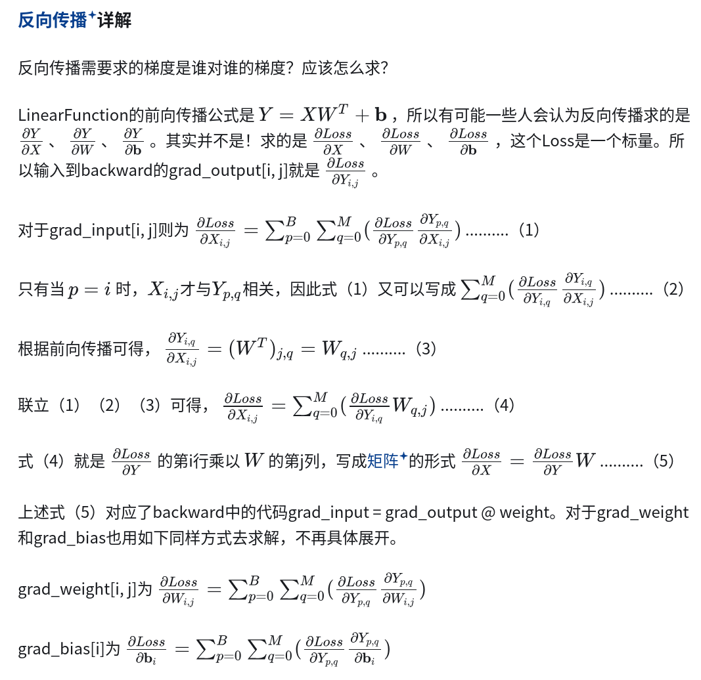

# 梯度反向传播

https://pytorch.org/tutorials/beginner/basics/autogradqs_tutorial.html

```python
optimizer = torch.optim.Adam(model.parameters(), lr=learning_rate)

# calculate a scalar loss related to the parameters of the model
loss = ...

optimizer.zero_grad()
loss.backward()
optimizer.step()
```

首先，定义优化器 `optimizer = torch.optim.Adam(model.parameters(), lr=learning_rate)` 该优化器会根据各个可训练参数张量`（model.parameters()）`对应的梯度，来更新这些可训练参数张量的值，该优化过程通过调用 `optimizer.step()` 实现。

定义完成优化器后，根据具体任务定义损失函数。损失函数必须是各个可训练参数张量的函数，这样，进行自动梯度计算时，才能正确地将梯度信息反向传播到可训练参数张量。

计算得到损失函数后，在进行自动梯度计算之前，必须利用 `optimizer.zero_grad()` 先将各个张量现有的梯度全部置零。这是因为 Pytorch 在每次 `backward()` 之后，都会将新的梯度信息累加到现有的梯度信息上，而不是覆盖掉现有的梯度信息。

然后就是以损失函数为输出量，各个训练参数张量为输入量，计算梯度。该步对应 `loss.backward()`。需要注意的是，进行 backward 后，如果没有设置额外的 `retain_graph` 参数，计算图就会被销毁，此时就不能进行第二次 backward 了。也正如上一段中提到的，如果设置了 `retain_graph=True` 且进行了第二次 backward，则梯度会变成只进行一次 backward 的两倍。

最后让优化器利用梯度对各个张量的值进行更新： `optmizer.step()`。

## pytorch 求导相关

torch.tensor 具有如下属性：

* 查看 是否可以求导 `requires_grad`
* 查看 运算名称 `grad_fn`
* 查看 是否为叶子节点 `is_leaf`
* 查看 导数值 `grad `

PyTorch提供两种求梯度的方法：

* `backward()` 给叶子节点填充.grad字段
* `torch.autograd.grad()`直接返回梯度

使用`backward()`函数反向传播计算tensor的梯度时，并不计算所有tensor的梯度，而是只计算满足这几个条件的tensor的梯度：

1. 类型为叶子节点
2. `requires_grad=True`
3. 依赖该tensor的所有tensor的`requires_grad=True`

所有满足条件的变量梯度会自动保存到对应的grad属性里。

```python
x = torch.tensor(2., requires_grad=True)

a = torch.add(x, 1)
b = torch.add(x, 2)
y = torch.mul(a, b)

# 使用backward求导
y.backward()
print(x.grad)
>>>tensor(7.)

print("requires_grad: ", x.requires_grad, a.requires_grad, b.requires_grad, y.requires_grad)
print("is_leaf: ", x.is_leaf, a.is_leaf, b.is_leaf, y.is_leaf)
print("grad: ", x.grad, a.grad, b.grad, y.grad)

>>>requires_grad:  True True True True
>>>is_leaf:  True False False False
>>>grad:  tensor(7.) None None None

#使用autograd.grad()
grad = torch.autograd.grad(outputs=y, inputs=x)
print(grad[0])
>>>tensor(7.)
```

然后结合temptest和这篇文章讲清楚：

https://zhuanlan.zhihu.com/p/279758736#:~:text=PyTorch%E6%8F%90%E4%BE%9B%E4%B8%A4


对于Jacobian矩阵的求导，矩阵求导

看这篇：
https://zhuanlan.zhihu.com/p/407043909#:~:text=%E5%9C%A8%E6%9C%BA%E5%99%A8%E5%AD%A6%E4%B9%A0/%E6%B7%B1%E5%BA%A6%E5%AD%A6%E4%B9%A0#:~:text=%E5%9C%A8%E6%9C%BA%E5%99%A8%E5%AD%A6%E4%B9%A0/%E6%B7%B1%E5%BA%A6%E5%AD%A6%E4%B9%A0

https://zhuanlan.zhihu.com/p/288541909




https://towardsdatascience.com/pytorch-autograd-understanding-the-heart-of-pytorchs-magic-2686cd94ec95

写代码时常见的语句，每句话的含义解释清楚

```python
optimizer = torch.optim.SGD(model.parameters(), lr=0.1, momentum=0.9)
optimizer.zero_grad()
loss_fn(model(input), target).backward()
optimizer.step() 
```

计算图的事情也要讲清楚：

结合这篇https://zhuanlan.zhihu.com/p/33378444

然后对于grad_variables参数的理解，看这三篇：

* https://zhuanlan.zhihu.com/p/29923090
* https://zhuanlan.zhihu.com/p/65609544
* https://www.cnblogs.com/zhouyang209117/p/11023160.html