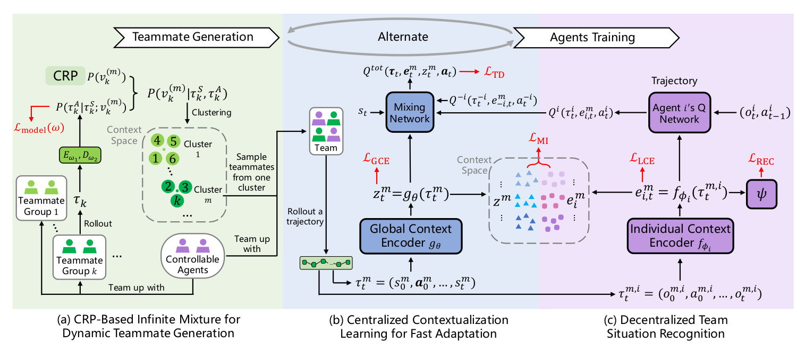

# Fast teammates adaptation in the presence of sudden policy change

## Background

### Dec-POMDP

A Dec-POMDP can be described as follows:

$M = <I, S, {Ai}, P, R, {Ωi}, O, h >$

$I$, the set of agents
$S$, the set of states with initial state $s_0$
$A_i$, the set of actions for agent $i$, with $A$ = $×_iA_i$ the set of joint actions
$P$, the state transition probabilities: $P(s'| s, a)$, the probability of the environment transitioning to state $s'$ given it was in state s and agents took actions a
$R$, the global reward function: $R(s, a)$, the immediate reward the system receives for being in state s and agents taking actions a
$Ω_i$, the set of observations for agent $i$, with $Ω$ = $×_iΩ_i$ the set of joint observations
$O$, the observation probabilities: $O(o| s, a)$, the probability of agents seeing observations $o$, given the state is $s$ and agents take actions $a$
$h$, the horizon, whether infinite or if finite, a positive integer
when $h$ is infinite a discount factor, $0 ≤ γ < 1 $, is used

### Chinese restaurant process (CRP)

https://www.cs.princeton.edu/courses/archive/fall07/cos597C/scribe/20070921.pdf

***Definition*** (Chinese Restaurant Process) Imagine an infinite number of tables labeled **1**,**2**,**…**. Customers come in one by one.

* Customer #1 sits at table 1.
* Customer #$i$ sits at:
  * an occupied table $j$ with probability ∝ the number of people in table $j$, or
  * the first unoccupied table with probability ∝ $\alpha$.
* If any customer sits at an empty table $j$, the customer orders food $θ_j∼H$ to be shared in the table.

If customer #$i$ sits at table $j$, we let $z_i=j$ and $\bar{θ_{i}}=θ_j$.

Let $N_j$ be the number of people at table $j$. For customer #$(n+1), we have

* $P ⁣(choose\ table\ j)=\frac{N_j}{α+N}$
* $P ⁣(choose\ a\ new\ table)=\frac{\alpha}{α+N}$

代码在code/CRP.py

背景（问题建模，历史和当前进展
motivation
相关工作（baseline）
method
exp
result（改进，理解）

## method

### Teammate Generation (CRP)

To adapt to the sudden change in teammates with diverse behaviors in one episode rapidly during evaluation, we expect to maintain **a set of diverse policies** to simulate the possibly encountered teammates in the training phase.

为了应对行为的突变，需要准备所有可能遇到的队友情形对应的策略。

Accordingly, we expect to acquire clearly distinguishable boundaries of teammates’ behaviors by applying a behavior-detecting module to assign teammate groups with similar behaviors to the same cluster.

但是不可能单独考虑每一个新出现的队友，因此需要把他们归入具有清晰边界的不同类别中，方法就是使用一个行为检测模块（也就是本部分干的事情）。

* formulate the teammate generation process as a stream of teammate groups
  with different trajectory batch D1, D2, ... where each batch Dk is a set of trajectories τ = (s0 , a0 ..., sT ) sampled from the interactions between the k th teammate group and the environment, and T is the horizon length
* utilize a trajectory encoder Eω1 parameterized by ω1 to encode τ into a latent space
  * we partition the trajectory τ into τ S = (s0 , ...sT −1 , sT ) and
    τ A = (a0 , ..., aT −1 ), and a transformer architecture is applied to extract features from the trajectory and represent it as v = Eω1 (τ )
* P (vk |τk ) = P (vk |τkS , τkA )
* P (vk |τkS , τkA ) ∝ P (vk )P (τ09kA |τkS ; vk )

在论文中，公式（1）通常表示后验概率的表达式，它结合了先验概率和似然函数。假设公式（1）的形式如下：

$P(v(m)_k | \tau_S^k, \tau_A^k) \propto P(v(m)_k) P(\tau_A^k | \tau_S^k; v(m)_k)$

这个公式的含义和意义如下：

### 含义

- $ P(v(m)_k | \tau_S^k, \tau_A^k)$：这是在给定状态序列 $\tau_S^k$ 和动作序列 $\tau_A^k$ 的情况下，第 $k$ 个队友组属于第 $m $ 个聚类的后验概率。
- $P(v(m)_k)$：这是第$k$个队友组属于第$m$个聚类的先验概率。
- $P(\tau_A^k | \tau_S^k; v(m)_k)$：这是在给定状态序列$\tau_S^k$和聚类$v(m)_k$的情况下，观察到动作序列$\tau_A^k$的似然度。

### 得出过程

这个公式是通过贝叶斯定理得出的，贝叶斯定理是概率论中的一个基本公式，它描述了如何根据新的证据（数据）更新对假设的信念（概率）。公式可以写为：

$P(H | E) = \frac{P(E | H) P(H)}{P(E)}$

其中：

- \( H \) 是假设（在这里是聚类 \( v(m)_k \)）。
- \( E \) 是证据（在这里是状态和动作序列 \( \tau_S^k, \tau_A^k \)）。
- \( P(H | E) \) 是后验概率。
- \( P(E | H) \) 是似然度。
- \( P(H) \) 是先验概率。
- \( P(E) \) 是证据的边缘概率，通常作为归一化常数。

在论文的上下文中，公式（1）是通过将贝叶斯定理应用于聚类分配问题得出的。

在贝叶斯定理中，后验概率 $P(H | E) $ 是通过将似然度 $P(E | H)$与先验概率 $P(H)$相乘，然后除以证据的边缘概率$P(E)$来计算的。公式（1）中的每个量对应贝叶斯定理的部分如下：

- $P(v(m)_k | \tau_S^k, \tau_A^k)$：这是后验概率，对应于$P(H | E)$。
- $P(v(m)_k)$：这是先验概率，对应于$P(H)$。
- $P(\tau_A^k | \tau_S^k; v(m)_k)$：这是似然度，对应于$P(E | H)$。

公式（1）中的量与贝叶斯定理的关系是：

$P(v(m)_k | \tau_S^k, \tau_A^k) = \frac{P(\tau_A^k | \tau_S^k; v(m)_k) P(v(m)_k)}{P(\tau_S^k, \tau_A^k)}$

然而，公式（1）中使用的是比例符号$\propto$而不是等号，这是因为分母$P(\tau_S^k, \tau_A^k)$通常很难计算，并且在进行聚类分配决策时可以被视为一个归一化常数。因此，我们通常只关注似然度和先验概率的乘积，它与后验概率成正比。这意味着我们可以通过比较不同聚类的似然度和先验概率的乘积来决定新队友组属于哪个聚类，而不需要显式计算归一化常数。

总结来说，公式（1）中的量分别对应贝叶斯定理中的后验概率、先验概率和似然度，而使用比例符号是因为在实际应用中我们通常只关心相对概率，而不是绝对概率。

这里的关键点在于，状态序列 τS**τ**S**** 和动作序列 τA**τ**A**** 通常不是独立同分布的。动作序列 τA**τ**A**** 往往是在特定状态序列 τS**τ**S**** 下的响应或结果。因此，考虑状态序列 τS**τ**S**** 作为条件来计算动作序列 τA**τ**A**** 的概率是有道理的，反映了状态对动作的直接影响。

### 

让我们逐步分析这句话：

1. **先验分布（Eqn. (2)）**：这代表了在观察任何数据之前，我们对队友可能属于不同聚类的初始信念。在CRP的背景下，先验分布通常由一个参数 α**α**（集中度参数）控制，它决定了新聚类被创建的倾向。
2. **预测性似然（Eqn. (3)）**：这代表了在给定队友组的行为特征（由编码器 Eω1**E**ω**1****** 编码）的情况下，观察到队友组的行为序列的概率。这是通过解码器 Dω2**D**ω**2****** 来估计的，它尝试根据编码的表示重构行为序列。
3. **结合先验和似然**：通过结合这两个组成部分，我们得到了后验分布，它告诉我们每个聚类给定观察到的行为序列的可能性。这个后验分布用于决定新队友组最有可能属于哪个聚类。
4. **聚类决策**：通过评估后验分布，我们可以选择具有最高后验概率的聚类，从而将新队友组分配到该聚类。这个过程有助于我们识别和定义队友行为的可区分边界。
5. **清晰可区分的边界**：通过不断地将新队友组分配到现有聚类或创建新聚类，我们可以建立一组明确定义且可区分的队友行为类型。这有助于在多智能体环境中实现更好的策略适应和协调。

### Contextualization Learning for Adaption

### Team Situation Recognition and Optimizaiton
