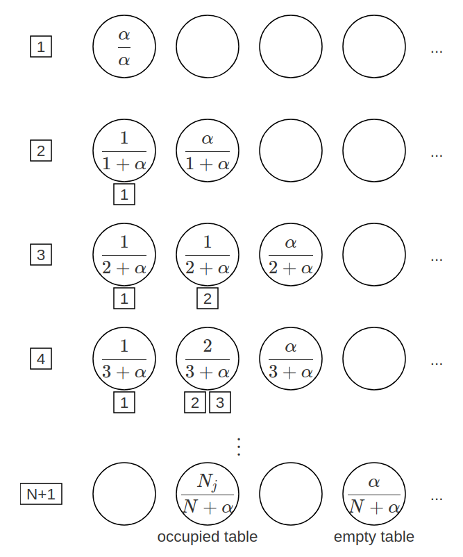

# Fast teammates adaptation in the presence of sudden policy change

## Background

### Dec-POMDP

A Dec-POMDP can be described as follows:

$M = <I, S, {Ai}, P, R, {Ωi}, O, h >$

$I$, the set of agents
$S$, the set of states with initial state $s_0$
$A_i$, the set of actions for agent $i$, with $A$ = $×_iA_i$ the set of joint actions
$P$, the state transition probabilities: $P(s'| s, a)$, the probability of the environment transitioning to state $s'$ given it was in state s and agents took actions a
$R$, the global reward function: $R(s, a)$, the immediate reward the system receives for being in state s and agents taking actions a
$Ω_i$, the set of observations for agent $i$, with $Ω$ = $×_iΩ_i$ the set of joint observations
$O$, the observation probabilities: $O(o| s, a)$, the probability of agents seeing observations $o$, given the state is $s$ and agents take actions $a$
$h$, the horizon, whether infinite or if finite, a positive integer
when $h$ is infinite a discount factor, $0 ≤ γ < 1 $, is used

### Chinese restaurant process (CRP)

https://www.cs.princeton.edu/courses/archive/fall07/cos597C/scribe/20070921.pdf

***Definition*** (Chinese Restaurant Process) Imagine an infinite number of tables labeled **1**,**2**,**…**. Customers come in one by one.

* Customer #1 sits at table 1.
* Customer #$i$ sits at:
  * an occupied table $j$ with probability ∝ the number of people in table $j$, or
  * the first unoccupied table with probability ∝ $\alpha$.
* If any customer sits at an empty table $j$, the customer orders food $θ_j∼H$ to be shared in the table.

If customer #$i$ sits at table $j$, we let $z_i=j$ and $\bar{θ_{i}}=θ_j$.

Let $N_j$ be the number of people at table $j$. For customer #$(n+1), we have

* $P ⁣(choose\ table\ j)=\frac{N_j}{α+N}$

* $P ⁣(choose\ a\ new\ table)=\frac{\alpha}{α+N}$

代码在code/CRP.py

背景（问题建模，历史和当前进展
motivation
相关工作（baseline）
method
exp
result（改进，理解）
